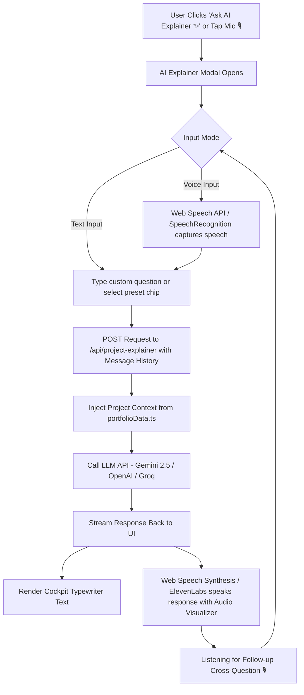

# AI Project Explainer — Voice-Enabled Integration Workflow & Architecture Blueprint

This document outlines the step-by-step workflow, data structures, API architecture, UI/UX design, and **Voice Command / Interactive Cross-Questioning System** for integrating an AI Project Explainer into every project on your cockpit portfolio.

---

## 1. System Architecture & Voice Loop Overview



---

## 2. Voice Integration Features (Speech-to-Text & Text-to-Speech)

### A. Voice Input (Speech-to-Text — STT)
- Uses the native browser **Web Speech API (`SpeechRecognition`)** or **Whisper API**.
- Includes a **Push-to-Talk / Continuous Mic button** (`🎙️ Hold or Tap to Speak`).
- Live speech transcript renders dynamically inside the prompt input box as the user speaks.

### B. Voice Output (Text-to-Speech — TTS)
- Uses **Web Speech Synthesis API (`window.speechSynthesis`)** with natural voice selection.
- Features a cockpit **Audio Waveform Visualizer** (`🔊`) that animates while the AI is speaking.
- **Audio Control Toggle**: Mute/Unmute audio responses at any time.

### C. Interactive Cross-Questioning (Multi-Turn Conversation)
- Maintains `messages` state (`user` and `assistant` role pairs) so recruiters or visitors can ask follow-up cross-questions (e.g., *"How does this compare to MongoDB?"* or *"What was the hardest bug you fixed?"*).

---

## 3. Data Model Extension (`src/data/portfolioData.ts`)

```typescript
export interface ProjectAIContext {
  architectureDiagramSummary?: string;
  keyChallengesSolved?: string[];
  systemDesignHighlights?: string[];
  sampleCodeSnippet?: string;
  suggestedQuestions?: string[];
}

export interface Project {
  id: string;
  title: string;
  description: string;
  longDescription?: string;
  image: string;
  videoUrl?: string;
  tags: string[];
  liveDemoUrl: string;
  githubUrl: string;
  featured: boolean;
  category: 'Full Stack' | 'AI/ML' | 'Frontend' | 'Backend';
  stars?: number;
  
  // Deep AI Explainer Context
  aiContext?: ProjectAIContext;
}
```

---

## 4. Multi-Turn Voice & Text API Route (`src/app/api/project-explainer/route.ts`)

```typescript
import { NextResponse } from 'next/server';
import { projectsData } from '@/data/portfolioData';

export async function POST(req: Request) {
  try {
    const { projectId, messages, prompt } = await req.json();
    const project = projectsData.find((p) => p.id === projectId);

    if (!project) {
      return NextResponse.json({ error: 'Project not found' }, { status: 404 });
    }

    const systemPrompt = `You are an AI System Architect and Technical Voice Representative for Abhinav Srivastava. 
Your job is to explain the project titled "${project.title}" and answer follow-up cross-questions from recruiters, hiring managers, or engineers.

Project Technical Context:
- Category: ${project.category}
- Tech Stack: ${project.tags.join(', ')}
- Description: ${project.description}
- Overview: ${project.longDescription || 'N/A'}
- Key Challenges: ${project.aiContext?.keyChallengesSolved?.join('; ') || 'N/A'}
- Architecture: ${project.aiContext?.architectureDiagramSummary || 'N/A'}

Rules for Voice Interaction:
1. Speak in a confident, technical, and natural conversational tone.
2. Keep responses under 3 short sentences so voice playback is crisp and engaging.
3. Be ready for technical cross-questioning about stack choices, scalability, and security.`;

    // Process multi-turn message history with LLM provider
    return NextResponse.json({
      reply: `For ${project.title}, we selected ${project.tags[0]} and ${project.tags[1]} to handle high concurrency. Feel free to ask me about the database schema or caching strategy!`
    });
  } catch (error) {
    return NextResponse.json({ error: 'Failed to generate voice response' }, { status: 500 });
  }
}
```

---

## 5. Front-End Voice Copilot Hook (`src/hooks/useVoiceAssistant.ts`)

```typescript
'use client';

import { useState, useEffect, useRef } from 'react';

export function useVoiceAssistant() {
  const [isListening, setIsListening] = useState(false);
  const [transcript, setTranscript] = useState('');
  const [isSpeaking, setIsSpeaking] = useState(false);
  const recognitionRef = useRef<any>(null);

  useEffect(() => {
    if (typeof window !== 'undefined' && ('SpeechRecognition' in window || 'webkitSpeechRecognition' in window)) {
      const SpeechRecognition = (window as any).SpeechRecognition || (window as any).webkitSpeechRecognition;
      recognitionRef.current = new SpeechRecognition();
      recognitionRef.current.continuous = false;
      recognitionRef.current.interimResults = true;

      recognitionRef.current.onresult = (event: any) => {
        const current = event.resultIndex;
        const text = event.results[current][0].transcript;
        setTranscript(text);
      };

      recognitionRef.current.onend = () => {
        setIsListening(false);
      };
    }
  }, []);

  const startListening = () => {
    setTranscript('');
    setIsListening(true);
    recognitionRef.current?.start();
  };

  const stopListening = () => {
    setIsListening(false);
    recognitionRef.current?.stop();
  };

  const speakText = (text: string) => {
    if (typeof window !== 'undefined' && 'speechSynthesis' in window) {
      window.speechSynthesis.cancel();
      const utterance = new SpeechSynthesisUtterance(text);
      utterance.rate = 1.0;
      utterance.pitch = 1.0;
      utterance.onstart = () => setIsSpeaking(true);
      utterance.onend = () => setIsSpeaking(false);
      window.speechSynthesis.speak(utterance);
    }
  };

  return { isListening, transcript, isSpeaking, startListening, stopListening, speakText };
}
```

---

## 6. Cockpit AI Explainer Modal with Voice UI (`src/components/AIExplainerModal.tsx`)

### Key Voice & UI Features:
1. **Interactive Microphone Bar**:
   - `🎙️ Tap to Speak (Voice Command)` with pulse glow when recording.
   - Live transcript preview.
2. **Audio Waveform Visualizer**:
   - Sound bar equalizer animation (`span` heights pulsing) when AI voice is active.
3. **Cross-Questioning Conversation Thread**:
   - Chat history container displaying previous user questions and AI voice responses.
4. **Preset Quick Chips**:
   - `⚡ How does this scale?`
   - `🛠️ What were the major challenges?`
   - `💼 3-Sentence Recruiter Summary`
   - `🔒 Security & Auth Breakdown`

---

## 7. Implementation Roadmap Summary

| Step | Task | Duration | Priority |
| :--- | :--- | :--- | :--- |
| **Step 1** | Update `portfolioData.ts` with `aiContext` fields for each project | ~15 mins | High |
| **Step 2** | Create multi-turn API route `/api/project-explainer` | ~20 mins | High |
| **Step 3** | Implement Web Speech STT & TTS Hook (`useVoiceAssistant.ts`) | ~20 mins | High |
| **Step 4** | Build Cockpit `AIExplainerModal.tsx` with Voice Mic & Waveform UI | ~30 mins | High |
| **Step 5** | Connect `Ask AI Explainer ✨` buttons across landing & project pages | ~10 mins | Medium |

---

> [!TIP]
> **Voice Capabilities**: The Web Speech API provides zero-cost STT and TTS out of the box in modern browsers (Chrome, Edge, Safari). For hyper-realistic natural voices, ElevenLabs API or OpenAI Realtime WebSockets can easily be plugged in later!
